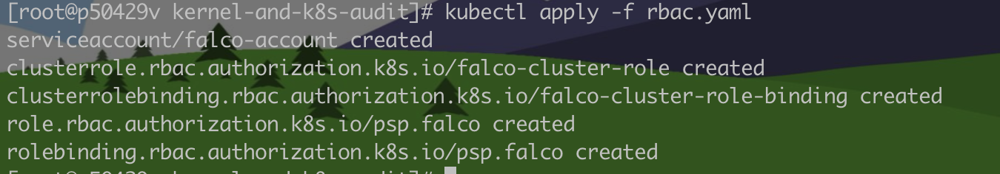
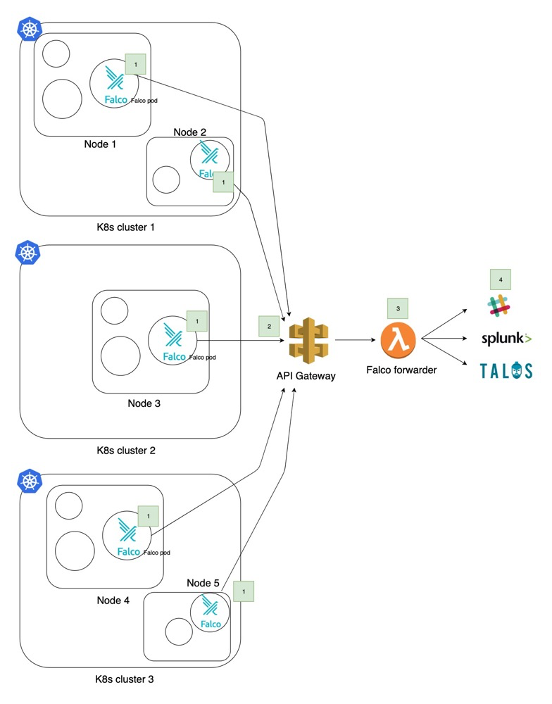

## 安装falco

falco:0.27.0

### **安装方式1： helm**

初始化参数：

https://github.com/falcosecurity/charts/tree/master/falco#introduction

```
FALCOCTL_NAME=falco-grpc.default.svc.cluster.local FALCOCTL_PATH=/tmp/certs falcoctl install tls

# 启用ebpf之后，falco会使用eBPF的模式进行事件捕获
helm install falco falcosecurity/falco \
    --set-file certs.server.key=/tmp/certs/server.key,certs.server.crt=/tmp/certs/server.crt,certs.ca.crt=/tmp/certs/ca.crt \
    --set --set ebpf.enabled=true,falco.grpc.enabled=true,falco.grpcOutput.enabled=true,falco.jsonOutput=true
    

helm install falco-exporter falcosecurity/falco-exporter  --set-file certs.ca.crt=/tmp/certs/ca.crt,certs.client.key=/tmp/certs/client.key,certs.client.crt=/tmp/certs/client.crt  
```

### **安装方式2：Deamonset **

```
git clone https://github.com/falcosecurity/evolution

cd evolution/deploy/kubernetes/kernel-and-k8s-audit

# 由于Kubernetes已提供v1.8 RBAC，因此在启用RBAC的情况下运行被认为是最佳实践。该目录提供了用于为Falco创建服务帐户的YAML，以及为该服务帐户授予适当权限的ClusterRoles和绑定。

kubectl create -f rbac.yaml

# 创建了针对Falco的最低特权PodSecurityPolicy。Falco服务帐户有权使用rbac.yaml清单中配置的帐户。

kubectl apply -f psp.yaml

# svc  设置成NodePort
kubectl apply -f service.yaml

# 配置文件
# 用ConfigMap来存储Falco配置。更新规则和配置时，而无需重建和重新部署Pod。ConfigMap中的内容是存储到etcd中的。

mkdir /root/falco-config
cp falco.yaml /root/falco-config/
cp rules/falco_rules.* /root/falco-config/
cp rules/k8s_audit_rules.yaml /root/falco-config/
cd /root/falco-config/
kubectl create configmap falco-config --from-file=/root/falco-config/

# 创建daemonset。Kubernetes 1.6开始，默认情况下，DaemonSets不在master上进行调度。

kubectl create -f daemonset.yaml
```




Falco是Sysdig开发的开源实时安全工具，设计用来检测在Kubernetes中的异常活动和入侵行为。

最初Falco通过编写内核模块对系统调用进行hook，但此方法有比较大的局限性。首先，很多云平台处于安全考虑不允许容器挂载内核模块，这就限制了falco所能部署的环境。其次，内核模块中的bug很可能导致整台宿主机crash，会影响到运行在同宿主机上的所有容器。

新版本的falco加入了对eBPF的支持，eBPF为应用程序运行在内核空间提供了技术支持，他会在内核空间提供虚拟进程，对程序进行安全检测后再允许其运行，不需要加载内核模块，用户空间可通过编程订阅相关系统调用。


Falco用一组预配置的规则，定义了需要注意的行为和事件。然后以DaemonSet方法运行在Kubernetes中，基于这些规则，Falco可以检测到任何调用Linux系统的行为，并为这些行为添加警报。

类似的行为可能来自于在容器内的shell运行脚步，或建立出站网络连接的二进制文件。这些事件可以通过Fluentd在STDERR上捕获，然后发送到ElasticSearch进行过滤或解除告警。从而可以帮助用户迅速应对如容器破坏或损毁的安全事故，减少此类事件造成的经济损失。 



## falco规则

https://sysdig.com/blog/getting-started-writing-falco-rules/

### macro

写好的一些 rule 条件或macros中可复用的部分。

### rule

当rule下的条件condition字段满足时，告警将会触发。

| key                    | 是否必需 | 描述                                                         |
| ---------------------- | -------- | ------------------------------------------------------------ |
| rule                   | yes      | 规则名，全局唯一。                                           |
| condition              | yes      | 针对系统调用事件的过滤表达式，用于判断规则是否匹配。Condition是基于Sysdig [filter语法](https://link.zhihu.com/?target=http%3A//www.sysdig.com/wiki/sysdig-user-guide/%23filtering)的bool表达式，Condition也可以基于Macros进行扩展。 |
| desc                   | yes      | 规则的长描述。                                               |
| output                 | yes      | 规则条件匹配时的输出                                         |
| priority               | yes      | 规则优先级。取值范围：`emergency`,`alert`,`critical`, `error`, `warning`, `notice`, `informational`, `debug` |
| enabled                | no       | 开关。默认开。                                               |
| tags                   | no       | 规则tags列表。                                               |
| warn_evttypes          | no       | 当设置为false时，Falco会抑制规则条件中没有event type的警告。 |
| skip-if-unknown-filter | no       | 当遇到不兼容的检查项时是否报错。                             |

### list

定义的一些集合，例如敏感文件列表。

```
- list: sensitive_file_names
  items: [/etc/shadow, /etc/sudoers, /etc/pam.conf, /etc/security/pwquality.conf]
```

可用于rules、macros，甚至嵌套到其他的list中。

### 更新规则

```
kubectl create --save-config cm falco-config --from-file falco-config/ -o yaml --dry-run | kubectl apply -f -
```

