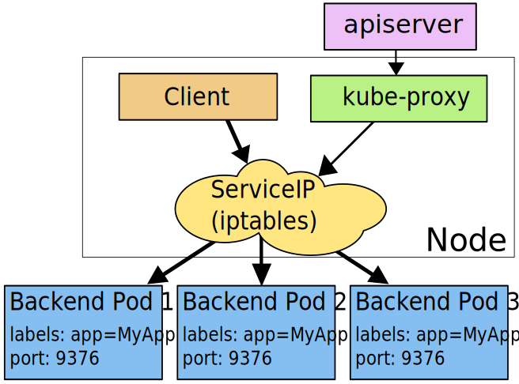

# 云原生


# 容器

容器：视图隔离、资源可控制、独立文件系统的进程合集。视图隔离，能看见部分进程、独立的主机名；控制资源使用率，如2G内存，一个CPU。

镜像：运行容器所需要的所有文件集合。镜像之间能相互服用。


资源视图隔离 namespace

控制资源使用率 cgroup

独立的文件系统 chroot


moby 是目前最流行的容器管理引擎，moby daemon 会对上提供有关于容器、镜像、网络以及 Volume的管理。moby daemon 所依赖的最重要的组件就是 containerd，containerd 是一个容器运行时管理引擎，其独立于 moby daemon ，可以对上提供容器、镜像的相关管理。containerd 底层有 containerd shim 模块，其类似于一个守护进程，这样设计的原因有几点： 

- 首先，containerd 需要管理容器生命周期，而容器可能是由不同的容器运行时所创建出来的，因此需要提供一个灵活的插件化管理。而 shim 就是针对于不同的容器运行时所开发的，这样就能够从 containerd 中脱离出来，通过插件的形式进行管理。 

- 其次，因为 shim 插件化的实现，使其能够被 containerd 动态接管。如果不具备这样的能力，当 moby daemon 或者 containerd daemon 意外退出的时候，容器就没人管理了，那么它也会随之消失、退出，这样就会影响到应用的运行。 

- 最后，因为随时可能会对 moby 或者 containerd 进行升级，如果不提供 shim 机制，那么就无法做到原地升级，也无法做到不影响业务的升级，因此 containerd shim 非常重要，它实现了动态接管的能力。


# k8s基础概念

## 安装

```shell
# 临时关闭swap。k8s要求禁用swap
swapoff -a 

vim /etc/hosts
192.168.102.138     k8s-master
192.168.102.137     k8s-node1

cat <<EOF > /etc/sysctl.d/k8s.conf
net.bridge.bridge-nf-call-ip6tables = 1
net.bridge.bridge-nf-call-iptables = 1
EOF

cat <<EOF > /etc/yum.repos.d/kubernetes.repo
[kubernetes]
name=Kubernetes
baseurl=https://mirrors.aliyun.com/kubernetes/yum/repos/kubernetes-el7-x86_64
enabled=1
gpgcheck=1
repo_gpgcheck=1
gpgkey=https://mirrors.aliyun.com/kubernetes/yum/doc/yum-key.gpg https://mirrors.aliyun.com/kubernetes/yum/doc/rpm-package-key.gpg
EOF

service docker start
# 版本 v1.20.1
yum install -y kubelet kubeadm kubectl

# 初始化
kubeadm init --kubernetes-version v1.20.1 --service-cidr=10.1.0.0/16 --pod-network-cidr=10.244.0.0/16
# 如果初始化失败 reset下重新初始化 
kubeadm reset

# 安装pod网络插件
kubectl apply -f https://raw.githubusercontent.com/coreos/flannel/master/Documentation/kube-flannel.yml
# 检查node状态
kubectl get nodes

# 添加node 执行master输出的命令
kubeadm join 192.168.102.138:6443 --token ihaeke.vrjy603eqs6tkogw --discovery-token-ca-cert-hash sha256:1aa320787364ccd45457e47af532a194a00aa20d9569243ab5e180bf57d6ad08

# error: failed to run Kubelet: failed to create kubelet: misconfiguration: kubelet cgroup driver: "cgroupfs" is different from docker cgroup driver: "systemd"​
# 错误原因：docker和k8s使用的cgroup不一致导致 官方建议使用systemd
# 修改docker为systemd 重启docker
cat > /etc/docker/daemon.json <<EOF
{
  "exec-opts": ["native.cgroupdriver=systemd"]
}
EOF
# vim /var/lib/kubelet/config.yaml 重启kubelet
cgroupDriver: systemd

# 如果忘记token 可以手动生成一个 格式"\\A([a-z0-9]{6})\\.([a-z0-9]{16})\\z"
kubeadm token create 360sec.lulululululululu
# 查看k8s证书 sha256
openssl x509 -pubkey -in /etc/kubernetes/pki/ca.crt | openssl rsa -pubin -outform der 2>/dev/null | openssl dgst -sha256 -hex | sed 's/^.* //'

```

创建deplyment

```
kubectl apply -f + yaml(url)
```

## 部署模式的变更


## 核心功能


## master组件

scheduler 是调度器，“调度器”顾名思义就是完成调度的操作，把一个用户提交的 Container，依据它对 CPU、对 memory 请求大小，找一台合适的节点，进行放置；自动装箱

controller 是控制器，它用来完成对集群状态的一些管理。比如刚刚我们提到的两个例子之中，第一个自动对容器进行修复、第二个自动进行水平扩张。

api server 所有组件都会和apiserver连接。组件与组件之间一般不进行独立的连接，都依赖于 API Server 进行消息的传送。

etcd 是一个分布式的一个存储系统，API Server 中所需要的这些原信息都被放置在 etcd 中，etcd 本身是一个高可用系统，通过 etcd 保证整个 Kubernetes 的 Master 组件的高可用性。


## node组件


真正去运行 Pod 的组件的是叫做 **kubelet**，也就是 Node 上最为关键的组件，它通过 API Server 接收到所需要 Pod 运行的状态，然后提交到 Container Runtime 组件中。

Kubernetes 并不会直接进行网络存储的操作，他们会靠 Storage Plugin 或者是网络的 Plugin 来进行操作。用户自己或者云厂商都会去写相应的 **Storage Plugin** 或者 **Network Plugin**，去完成存储操作或网络操作。

在 Kubernetes 自己的环境中，也会有 Kubernetes 的 Network，它是为了提供 Service network 来进行搭网组网的。真正完成 service 组网的组件的是 **Kube-proxy**，它是利用了 iptable 的能力来进行组建 Kubernetes 的 Network，就是 cluster network，以上就是 Node 上面的四个组件。

## master和node调用流程


提交一个 Pod 给 Kubernetes 进行部署，这个 Pod 请求首先会通过 CLI 或者 UI 提交给 Kubernetes API Server，下一步 API Server 会把这个信息写入到它的存储系统 etcd，之后 Scheduler 会通过 API Server 的 watch 或者叫做 notification 机制得到这个信息：有一个 Pod 需要被调度。

这个时候 Scheduler 会根据它的内存状态进行一次调度决策，在完成这次调度之后，它会向 API Server report 说：“OK！这个 Pod 需要被调度到某一个节点上。”

这个时候 API Server 接收到这次操作之后，会把这次的结果再次写到 etcd 中，然后 API Server 会通知相应的节点进行这次 Pod 真正的执行启动。相应节点的 kubelet 会得到这个通知，kubelet 就会去调 Container runtime 来真正去启动配置这个容器和这个容器的运行环境，去调度 Storage Plugin 来去配置存储，network Plugin 去配置网络。

## Volumn

Volume 就是卷的概念，它是用来管理 Kubernetes 存储的。


## Pod


因为容器之间原本是被 Linux Namespace 和 cgroups 隔开的，所以现在实际要解决的是怎么去打破这个隔离，然后共享某些事情和某些信息。这就是 Pod 的设计要解决的核心问题所在。

**1 共享网络**

比如说现在有一个 Pod，其中包含了一个容器 A 和一个容器 B，它们两个就要共享 Network Namespace。在 Kubernetes 里的解法是这样的：它会在每个 Pod 里，额外起一个 Infra container 小容器来共享整个 Pod 的 Network Namespace。


共享存储：把volume变成Pod level。所有同属于一个 Pod 的容器，他们共享所有的 volume。


```
kubectl get pods [name]
```


## 容器设计模式

sidecar：通过在Pod里定义专门容器，辅助主业务容器。与主业务逻辑解耦，实现独立发布和能力重用。

InitContainer

## Namespace

Namespace 是用来做一个集群内部的逻辑隔离的，它包括鉴权、资源管理等。Kubernetes 的每个资源，比如刚才讲的 Pod、Deployment、Service 都属于一个 Namespace，同一个 Namespace 中的资源需要命名的唯一性，不同的 Namespace 中的资源可以重名。


## Kubernetes API

http+json

cubectl 调用api的命令行工具，也可以使用UI，或直接HTTP请求。


## YAML文件

如果我们去提交一个 Pod，或者 get 一个 Pod 的时候，它的 content 内容都是用 JSON 或者是 YAML 表达的。

对 Pod 资源的描述也分为以下几个部分：

1. API version 比如在这个例子中是 V1，它也会描述我在操作哪个资源；比如说我的 **kind** 如果是 pod。

2. Metadata。**Name**，**Labels**识别资源的标签，Antotations用来描述多个资源之间相互关系的 OwnerReference。

3. Spec 也就是我们希望 Pod 达到的一个预期的状态。比如说它内部需要有哪些 container 被运行；比如说这里面有一个 nginx 的 container，它的 image 是什么？它暴露的 port 是什么？

   当我们从 Kubernetes API 中去获取这个资源的时候，一般来讲在 Spec 下面会有一个项目叫 **status**，它表达了这个资源当前的状态；比如说一个 Pod 的状态可能是正在被调度、或者是已经 running、或者是已经被 terminates，就是被执行完毕了。

### 1. 元数据

#### Label

给资源打的标签（键值对）。通过 label，kubernetes 的 API 层就可以对这些资源进行一个筛选，那这些筛选也是 kubernetes 对资源的集合所表达默认的一种方式。

Deployment 和 Service 也是通过 label selector 来进行 select 选取的一组 Pod。

```
# 查看 pod labels
kubectl get pods --show-labels 
# 打标签
kubectl label pods [name] [key]=[value] 
# 修改标签是 加上--overwrite
kubectl label pods [name] [key]=[value] --overwrite
```

**seletor**

相等型	Tie=front,Env=dev

集合型 	tie in（front,back）/	tie notin（front,back）

是否存在某 lable : 如：Selector release，筛选所有带 release 标签的 Pod。

集合型和相等型的 Selector，也可以用“，”来连接，同样的标识逻辑”与“的关系。


```
# label selector 是 -l 参数指定的
kubectl get pods --show-labels -l env=test,env=dev
# 用引号来指定集合查找
kubectl get pods --show-labels -l 'env in (dev,test)'
```

#### **Annotations**

注解。


打注解的话，这里我们可以指定一个任意的字符串，比如说加上空格、加上逗号都可以

```
kubectl annotate pods [name] [key]='[value]'
```


#### Ownereference

Ownereference，所谓所有者，一般就是指集合类的资源，比如说 Pod 集合，就有 replicaset、statefulset。

集合类资源的控制器会创建对应的归属资源。比如：replicaset 控制器在操作中会创建 Pod，被创建 Pod 的 Ownereference 就指向了创建 Pod 的 replicaset，Ownereference 使得用户可以方便地查找一个创建资源的对象，另外，还可以用来实现级联删除的效果。

### 2. 控制器模式

#### 1.控制循环

控制型模式最核心的就是控制循环的概念。在控制循环中包括了控制器，被控制的系统，以及能够观测系统的传感器，三个逻辑组件。


当然这些组件都是逻辑的，外界通过修改资源 spec 来控制资源，控制器比较资源 spec 和 status，从而计算一个 diff，diff 最后会用来决定执行对系统进行什么样的控制操作，控制操作会使得系统产生新的输出，并被传感器以资源 status 形式上报，控制器的各个组件将都会是独立自主地运行，不断使系统向 spec 表示终态趋近。

#### 2.Sensor

控制循环中逻辑的传感器主要由 Reflector、Informer、Indexer 三个组件构成。

Reflector 通过 List 和 Watch K8s server 来获取资源的数据。List 用来在 Controller 重启以及 Watch 中断的情况下，进行系统资源的全量更新；而 Watch 则在多次 List 之间进行增量的资源更新；Reflector 在获取新的资源数据后，会在 Delta 队列中塞入一个包括资源对象信息本身以及资源对象事件类型的 Delta 记录，Delta 队列中可以保证同一个对象在队列中仅有一条记录，从而避免 Reflector 重新 List 和 Watch 的时候产生重复的记录。

Informer 组件不断地从 Delta 队列中弹出 delta 记录，然后把资源对象交给 indexer，让 indexer 把资源记录在一个缓存中，缓存在默认设置下是用资源的命名空间来做索引的，并且可以被 Controller Manager 或多个 Controller 所共享。之后，再把这个事件交给事件的回调函数。

#### 3.控制器模式总结

Kubernetes 控制器模式依赖声明式的 API。在容器编排体系中，我们可以执行一个应用实例副本数保持在 3 个，而不用明确的去扩容 Pod 或是删除已有的 Pod，来保证副本数在三个。


## 控制器

Kubernetes 中运行了一系列控制器来确保集群的当前状态与期望状态保持一致。

### ReplicaSet

`ReplicaSet（RS）` 的主要作用就是维持一组 Pod 副本的运行，保证一定数量的 Pod 在集群中正常运行，ReplicaSet 控制器会持续监听它说控制的这些 Pod 的运行状态，在 Pod 发送故障数量减少或者增加时会触发调谐过程，始终保持副本数量一定。


**ReplicaSet 控制器会通过定义的 Label Selector 标签去查找集群中的 Pod 对象，所以定义时replicas的selector Label必须和要控制的Label保持一致。**

```
apiVersion: apps/v1
kind: ReplicaSet  
metadata:
  name:  nginx-rs
  namespace: default
spec:
  replicas: 3  # 期望的 Pod 副本数量，默认值为1
  selector:  # Label Selector，必须匹配 Pod 模板中的标签
    matchLabels:
      app: nginx
  template:  # Pod 模板
    metadata:
      labels:
        app: nginx
    spec:
      containers:
      - name: nginx
        image: nginx
        ports:
        - containerPort: 80
```

Node 控制器负责监控节点的状态，并在节点出现故障时及时做出响应。总而言之，在 Kubernetes 中，每个控制器只负责某种类型的特定资源。

### Deployment


通过上图我们可以很清楚的看到，定义了3个副本的 Deployment 与 ReplicaSet 和 Pod 的关系，就是一层一层进行控制的。ReplicaSet 作用和之前一样还是来保证 Pod 的个数始终保存指定的数量，所以 Deployment 中的容器 `restartPolicy=Always` 是唯一的就是这个原因，因为容器必须始终保证自己处于 Running 状态，ReplicaSet 才可以去明确调整 Pod 的个数。而 Deployment 是通过管理 ReplicaSet 的数量和属性来实现`水平扩展/收缩`以及`滚动更新`两个功能的。

一个新命令：**kubectl scale**，扩容或缩容 Deployment、ReplicaSet、Replication Controller或 Job 中Pod数量。

滚动更新：

```
apiVersion: apps/v1
kind: Deployment  
metadata:
  name:  nginx-deploy
  namespace: default
spec:
  replicas: 3  
  selector:  
    matchLabels:
      app: nginx
  minReadySeconds: 5
  strategy:  
    type: RollingUpdate  # 指定更新策略：RollingUpdate和Recreate
    rollingUpdate:
      maxSurge: 1
      maxUnavailable: 1
  template:  
    metadata:
      labels:
        app: nginx
    spec:
      containers:
      - name: nginx
        image: nginx:1.7.9
        ports:
        - containerPort: 80
```


```
# 查看此次滚动更新的状态
kubectl rollout status deployment
# 暂停滚动更新
kubectl rollout pause
# 查看历史
kubectl rollout history
# 回滚上一个版本
kubectl rollout undo
# 回滚到指定版本
kubectl rollout undp [deploy] --to-revision=1
```

回滚的操作滚动的`revision`始终是递增的。

### StatefulSet

StatefulSet 中的 Pod 拥有一个具有稳定的、独一无二的身份标志。这个标志基于 StatefulSet 控制器分配给每个 Pod 的唯一顺序索引。Pod 的名称的形式为`<statefulset name>-<ordinal index>`。我们这里的对象拥有两个副本，所以它创建了两个 Pod 名称分别为：web-0 和 web-1。

通过 `Headless Service`，StatefulSet 就保证了 Pod 网络标识的唯一稳定性，由于 Pod IP 并不是固定的，所以我们访问`有状态应用`实例的时候，就必须使用 DNS 记录的方式来访问了，所以很多同学偶尔有固定的 Pod IP 的需求，或许可以用这种方式来代替。


### DaemonSet

`DaemonSet`用于在每个 Kubernetes 节点中将守护进程的副本作为后台进程运行，说白了就是在每个节点部署一个 Pod副本，当节点加入到 Kubernetes 集群中，Pod 会被调度到该节点上运行，当节点从集群只能够被移除后，该节点上的这个 Pod 也会被移除，当然，如果我们删除 DaemonSet，所有和这个对象相关的 Pods都会被删除。

**我们观察可以发现除了 master 节点之外的4个节点上都有一个相应的 Pod 运行，因为 master 节点上默认被打上了`污点`，所以默认情况下不能调度普通的 Pod 上去。**


### Job 与 CronJob

`Job` 负责处理任务，即仅执行一次的任务，它保证批处理任务的一个或多个 Pod 成功结束。而`CronJob` 则就是在 `Job` 上加上了时间调度。

```
apiVersion: batch/v1
kind: Job
metadata:
  name: job-demo
spec:
  template:
    spec:
      restartPolicy: Never
      containers:
      - name: counter
        image: busybox
        command:
        - "bin/sh"
        - "-c"
        - "for i in 9 8 7 6 5 4 3 2 1; do echo $i; done"
```

`Job` 的 `RestartPolicy` 仅支持 `Never` 和 `OnFailure` 两种，不支持 `Always`，我们知道 `Job` 就相当于来执行一个批处理任务，执行完就结束了。

如果的任务执行失败了，我们这里定义了 `restartPolicy=Never`，那么任务在执行失败后 Job 控制器就会不断地尝试创建一个新 Pod，当然，这个尝试肯定不能无限进行下去。我们可以通过 Job 对象的 `spec.backoffLimit` 字段来定义重试次数，另外需要注意的是 Job 控制器重新创建 Pod 的间隔是呈指数增加的，即下一次重新创建 Pod 的动作会分别发生在 10s、20s、40s… 后。

如果我们定义的 `restartPolicy=OnFailure`，那么任务执行失败后，Job 控制器就不会去尝试创建新的 Pod了，它会不断地尝试重启 Pod 里的容器。

### HPA

Horizontal Pod Autoscaling（Pod 水平自动伸缩）


```
kubectl autoscale deployment hpa-demo --cpu-percent=10 --min=1 --max=10
```

## 配置管理

### ConfigMap

可变配置。`onfigMap` 提供了向容器中注入配置信息的能力，不仅可以用来保存单个属性，还可以用来保存整个配置文件，比如我们可以用来配置一个 redis 服务的访问地址，也可以用来保存整个 redis 的配置文件。

明文存储。取Config：configMapKeyRef

调用方式：

- 设置环境变量的值
- 在容器里设置命令行参数
- 在数据卷里面挂载配置文件

### Secret

`Secret`用来保存敏感信息，例如密码、OAuth 令牌和 ssh key 等等，将这些信息放在 `Secret` 中比放在 Pod 的定义中或者 Docker 镜像中要更加安全和灵活。

`Secret` 主要使用的有以下四种类型：

- `Opaque`：base64 编码格式的 Secret，用来存储密码、密钥等；但数据也可以通过`base64 –decode`解码得到原始数据，所有加密性很弱。
- `kubernetes.io/dockerconfigjson`：用来存储私有`docker registry`的认证信息。
-  generic：Create a secret from a local file, directory or literal value
- tls：Create a TLS secret
- `kubernetes.io/service-account-token`：用于被 `ServiceAccount` ServiceAccount 创建时 Kubernetes 会默认创建一个对应的 Secret 对象。Pod 如果使用了 ServiceAccount，对应的 Secret 会自动挂载到 Pod 目录 `/run/secrets/kubernetes.io/serviceaccount` 中。
- `bootstrap.kubernetes.io/token`：用于节点接入集群的校验的 Secret

```
apiVersion: v1
kind: Secret
metadata:
  name: mysecret
type: Opaque
data:
  username: YWRtaW4=
  password: YWRtaW4zMjE=
```

两种调用方式：

1. 通过环境变量

   ```
   apiVersion: v1
   kind: Pod
   metadata:
     name: secret1-pod
   spec:
     containers:
     - name: secret1
       image: busybox
       command: [ "/bin/sh", "-c", "env" ]
       env:
       - name: USERNAME
         valueFrom:
           secretKeyRef:
             name: mysecret
             key: username
       - name: PASSWORD
         valueFrom:
           secretKeyRef:
             name: mysecret
             key: password
   ```

2. 通过volume

   ```
   apiVersion: v1
   kind: Pod
   metadata:
     name: secret2-pod
   spec:
     containers:
     - name: secret2
       image: busybox
       command: ["/bin/sh", "-c", "ls /etc/secrets"]
       volumeMounts:
       - name: secrets
         mountPath: /etc/secrets
     volumes:
     - name: secrets
       secret:
        secretName: mysecret
   ```

**相同点**

- key/value的形式
- 属于某个特定的命名空间
- 可以导出到环境变量
- 可以通过目录/文件形式挂载
- 通过 volume 挂载的配置信息均可热更新

**不同点**

- Secret 可以被 ServerAccount 关联
- Secret 可以存储 `docker register` 的鉴权信息，用在 `ImagePullSecret` 参数中，用于拉取私有仓库的镜像
- Secret 支持 `Base64` 加密
- Secret 分为 `kubernetes.io/service-account-token`、`kubernetes.io/dockerconfigjson`、`Opaque` 三种类型，而 `Configmap` 不区分类型

### ServiceAccount

`ServiceAccount` 主要是用于解决 Pod 在集群中的身份认证问题的。认证使用的授权信息其实就是利用前面我们讲到的一个类型为 `kubernetes.io/service-account-token` 进行管理的。

`ServiceAccount` 是命名空间级别的，每一个命名空间创建的时候就会自动创建一个名为 `default` 的 `ServiceAccount` 对象。

在 `data` 区域我们可以看到有3个信息：

- `ca.crt`：用于校验服务端的证书信息
- `namespace`：表示当前管理的命名空间
- `token`：用于 Pod 身份认证的 Token

对应的 `Secret` 会自动挂载到 Pod 的 `/var/run/secrets/kubernetes.io/serviceaccount/` 目录中，这样我们就可以在 Pod 里面获取到用于身份认证的信息了。这样当Pod访问集群的时候，就可以默认利用挂载到 Pod 内部的 `token` 文件来认证 Pod 的身份，`ca.crt` 则用来校验服务端。

`ServiceAccount` 背后的 Secret 挂载到 Pod 里面的两个文件：`token` 和 `ca.crt`，然后通过环境变量获取到 APIServer 的访问地址（ Service 信息通过环境变量的方式注入到 Pod 中），然后通过 `ca.cart` 校验服务端是否可信，最后服务端会根据我们提供的 `token` 文件对 Pod 进行认证。

## 三种IP

- Node IP：Node 节点的 IP 地址
- Pod IP: Pod 的 IP 地址
- Cluster IP: Service 的 IP 地址

Node IP 是 Kubernetes 集群中节点的物理网卡 IP 地址(一般为内网)，所有属于这个网络的服务器之间都可以直接通信，所以 Kubernetes 集群外要想访问 Kubernetes 集群内部的某个节点或者服务，肯定得通过 Node IP 进行通信。

Pod IP 是每个 Pod 的 IP 地址，它是网络插件进行分配的。

 Cluster IP 是一个虚拟的 IP，仅仅作用于 Kubernetes Service 这个对象，由 Kubernetes 自己来进行管理和分配地址。

## 网络

### 网络插件flannal

`Flannel` 是 CoreOS（Etcd 的公司）推出的一个 Overlay 类型的容器网络插件，目前支持三种后端实现：`UDP`、`VXLAN`、`host-gw` 三种方式。

Flannal配置修改后，需要重建所有的flannal pod生效：

```
kubectl delete pod -n kube-system -l app=flannel
```


最后一栏显示的不是进程的 ID 和名称，而是一个破折号`“-”`，这说明 UDP 的8472端口不是由用户态的进程在监听的，也证实了`VXLAN`模块工作在内核态模式下。

### NetworkPolicy

网络隔离：NetworkPolicy。默认情况下 Pod 是可以接收来自任何发送方的请求，也可以向任何接收方发送请求。

Flannel没有实现NetworkPolicy。

```
apiVersion: networking.k8s.io/v1
kind: NetworkPolicy
metadata:
  name: test-network-policy
  namespace: default
spec:
  podSelector:
    matchLabels:
      role: db
  policyTypes:
  - Ingress
  - Egress
  ingress:
  - from:
    - ipBlock:
        cidr: 172.17.0.0/16
        except:
        - 172.17.1.0/24
    - namespaceSelector:
        matchLabels:
          project: myproject
    - podSelector:
        matchLabels:
          role: frontend
  - ports:
    - protocol: TCP
      port: 80
  egress:
  - to:
    - ipBlock:
        cidr: 10.0.0.0/24
    ports:
    - protocol: TCP
      port: 5978
```

NetworkPolicy 目前只支持定义 `ingress` 规则。

spec.podSelector本质上是为该策略定义 “目标pod”。留空的话作用于当前namespace下的所有pod。

一旦 Pod 被 NetworkPolicy 选中，那么这个 Pod 就会进入`“拒绝所有”（Deny All）`的状态，即这个 Pod 既不允许被外界访问，也不允许对外界发起访问，所以 NetworkPolicy 定义的规则，都是**白名单**。

-Ingress 入站流量 

-Egress 出站流量

### Service

一个抽象，把 Pod 的访问能力抽象成一个 vip ，实现这个的 Kubernetes 的抽象就叫 Service。


```
apiVersion: v1
kind: Service
metadata:
  name: myservice
spec:
  selector:
    app: myapp
  ports:
  - protocol: TCP
    port: 80
    targetPort: 8080
    name: myapp-http
```

Service 能够将一个接收端口映射到任意的 targetPort。默认情况下，targetPort 将被设置为与 port 字段相同的值。

可能更有趣的是，targetPort 可以是一个字符串，引用了 backend Pod 的一个端口的名称。因实际指派给该端口名称的端口号，在每个 backend Pod 中可能并不相同，所以对于部署和设计 Service，这种方式会提供更大的灵活性。

**另外 Service 能够支持 TCP 和 UDP 协议，默认是 TCP 协议。**不在http层，因此回话亲和性只能通过None 和 ClientIP，不能通过cookie。

#### kube-proxy

service组网是通过每个node上的kube-proxy 进程负责。默认为iptables模式。

iptables模式：kube-proxy 会监视 apiserver 对 Service 对象和 Endpoints 对象的添加和移除。对每个 Service，它会添加上 iptables 规则，从而捕获到达该 Service 的 clusterIP（虚拟 IP）和端口的请求，进而将请求重定向到 Service 的一组 backend 中的某一个 Pod 上面。



#### 服务暴露类型

- ClusterIP：通过集群的内部 IP 暴露服务，服务只能够在集群内部可以访问。
- NodePort：通过每个 Node 节点上的 IP 和静态端口（NodePort）暴露服务。
- LoadBalancer：外部负载均衡器可以路由到 NodePort 服务和 ClusterIP 服务。
- ExternalName：通过返回 `CNAME` ，可以将外部服务映射到 `externalName` 字段的内容

ExternalName 是 Service 的特例，它没有 `selector`，也没有定义任何的端口和 Endpoint。对于运行在集群外部的服务，它通过返回该外部服务的别名这种方式来提供服务。

引入外部服务还可以通过直接定义Endpoints创建service

```
apiVersion: v1
kind: Service
metadata:
  name: etcd-k8s
  namespace: kube-system
  labels:
    k8s-app: etcd
spec:
  type: ClusterIP
  clusterIP: None
  ports:
  - name: port
    port: 2379

---

apiVersion: v1
kind: Endpoints
metadata:
  name: etcd-k8s  # 名称必须和 Service 一致
  namespace: kube-system
  labels:
    k8s-app: etcd
subsets:
- addresses:
  - ip: 10.151.30.57  # Service 将连接重定向到 endpoint
  ports:
  - name: port
    port: 2379   # endpoint 的目标端口
```

上面这个服务就是将外部的 etcd 服务引入到 Kubernetes 集群中来。**（可利用该机制攻击引入反连？？？待研究）**

#### 获取客户端 IP

当集群内的客户端连接到服务的时候，是支持服务的 Pod 可以获取到客户端的 IP 地址的。但是，当通过节点端口接收到连接时，由于对数据包执行了源网络地址转换（SNAT），因此数据包的源 IP 地址会发生变化，后端的 Pod 无法看到实际的客户端 IP，对于某些应用来说是个问题，比如，nginx 的请求日志就无法获取准确的客户端访问 IP 了。

```
spec:
  externalTrafficPolicy: Local
```

Service 中配置了 `externalTrafficPolicy=Local`，并且通过服务的节点端口来打开外部连接，则 Service 会代理到本地运行的 Pod，如果本地没有本地 Pod 存在，则连接将挂起，比如我们这里设置上该字段更新，这个时候我们去通过 master 节点的 NodePort 访问应用是访问不到的，因为 master 节点上并没有对应的 Pod 运行，所以需要确保负载均衡器将连接转发给至少具有一个 Pod 的节点。

#### 服务发现

1. 环境变量

每个 Pod 启动的时候，会通过环境变量设置所有服务的 IP 和 port 信息，这样 Pod 中的应用可以通过读取环境变量来获取依赖服务的地址信息，这种方法使用起来相对简单，但是有一个很大的问题就是依赖的服务必须在 Pod 启动之前就存在，不然是不会被注入到环境变量中的。（当然我们可以通过 `initContainer` 之类的方法来确保 nginx-service 启动后再启动 Pod，但是这种方法毕竟增加了 Pod 启动的复杂性，所以这不是最优的方法，局限性太多了。）

2. DNS

DNS 服务不是一个独立的系统服务，而是作为一种 addon 插件而存在，现在比较推荐的两个插件：kube-dns 和 CoreDNS，实际上在比较新点的版本中已经默认是 CoreDNS 了，因为 kube-dns 默认一个 Pod 中需要3个容器配合使用，CoreDNS 只需要一个容器即可，我们在前面使用 kubeadm 搭建集群的时候直接安装的就是 CoreDNS 插件。


- 普通的 Service：会生成 `servicename.namespace.svc.cluster.local` 的域名，会解析到 Service 对应的 ClusterIP 上，在 Pod 之间的调用可以简写成 `servicename.namespace`，如果处于同一个命名空间下面，甚至可以只写成 `servicename` 即可访问
- Headless Service：无头服务，就是把 clusterIP 设置为 None 的，会被解析为指定 Pod 的 IP 列表，同样还可以通过 `podname.servicename.namespace.svc.cluster.local` 访问到具体的某一个 Pod。

### Ingress


Ingress Controller 可以理解为一个监听器，通过不断地监听 kube-apiserver，实时的感知后端 Service、Pod 的变化，当得到这些信息变化后，Ingress Controller 再结合 Ingress 的配置，更新反向代理负载均衡器，达到服务发现的作用。其实这点和服务发现工具 consul、 consul-template 非常类似。

边缘节点：所谓的边缘节点即集群内部用来向集群外暴露服务能力的节点，集群外部的服务通过该节点来调用集群内部的服务，边缘节点是集群内外交流的一个Endpoint。


#### 配置自定义路径（URL Rewrite）


按照要求我们需要在 `path` 中匹配前缀 `app`，然后通过 `rewrite-target` 指定目标，修改后的 Ingress 对象如下所示：

```yaml
apiVersion: extensions/v1beta1
kind: Ingress
metadata:
  name: fe
  namespace: default
  annotations:
    kubernetes.io/ingress.class: "nginx"
    nginx.ingress.kubernetes.io/rewrite-target: /$2
spec:
  rules:
  - host: todo.qikqiak.com
    http:
      paths:
      - backend:
          serviceName: fe
          servicePort: 3000
        path: /app(/|$)(.*)
```


更新后，我们可以遇见到直接访问域名肯定是不行了，因为我们没有匹配 `/` 的 path 路径。但是我们带上 `app` 的前缀再去访问就可以了。